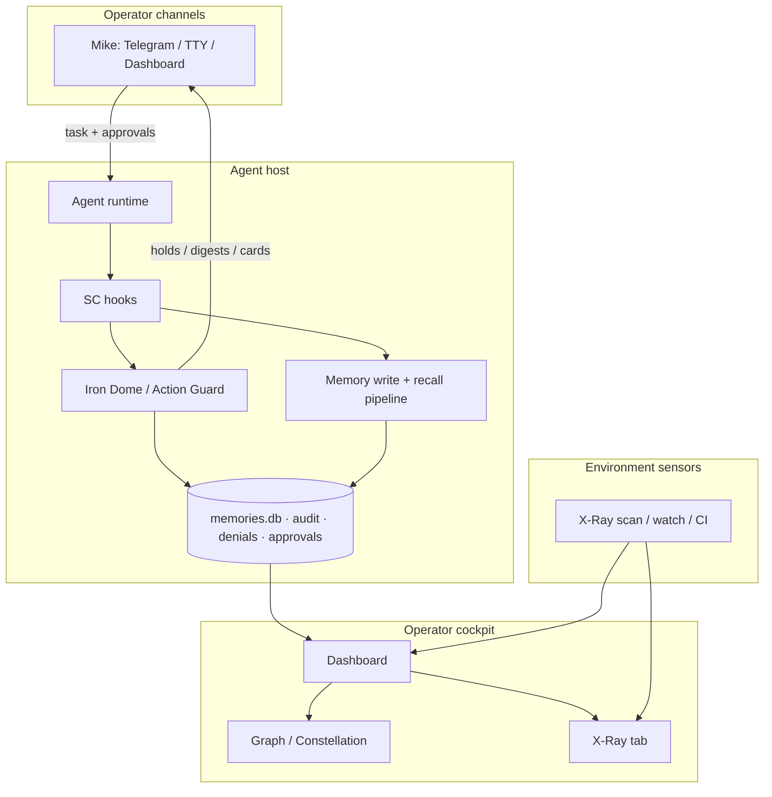
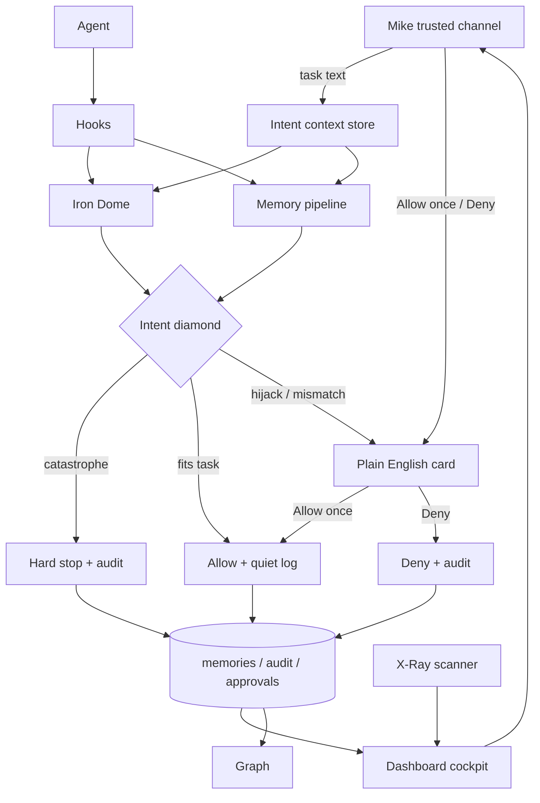
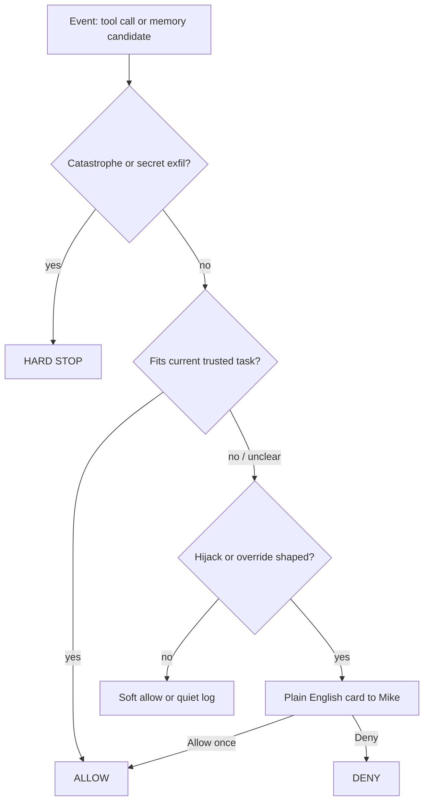

# Intent-first target architecture

**Status:** Normative target architecture (operator-directed)  
**Date:** 2026-08-24  
**Doctrine:** `2026-08-24-intent-first-doctrine.md`  
**Code:** not in this doc — diagrams + ownership only  

This document answers: **what we already built, what still belongs, and how intent-first sits on top without deleting Dashboard / X-Ray / Graph / Memory / Iron Dome.**

---

## 1. Answer in one breath

Intent-first is a **decision personality**, not a greenfield rewrite.

- **Keep** the boxes (memory plane, Iron Dome, dashboard, x-ray, graph, doctor, cloud).  
- **Change** the diamond inside Iron Dome + memory: *trusted task → allow work; hijack → plain card; catastrophe → hard stop.*  
- **Demote** siren-first DNP theatre and “pins or death” as the only air supply.

---

## 2. As-is architecture (what exists today)

```text
                         YOU (Telegram / TTY / Dashboard)
                                    │
                                    │ tasks + approvals
                                    ▼
┌──────────────────────────────────────────────────────────────┐
│                     AGENT HOST                                 │
│  Claude Code / OpenClaw / Hermes                               │
│       │                                                        │
│       │ hooks (PreToolUse, SessionStart, Stop, …)              │
│       ▼                                                        │
│  ┌──────────────────────┐    ┌─────────────────────────────┐  │
│  │ Iron Dome            │    │ Memory path                   │  │
│  │ Action Guard         │    │ remember / distill / inject │  │
│  │ tool intercept       │    │ defence pipeline            │  │
│  │ signals → hold/deny  │    │ → memories.db / quarantine  │  │
│  │ cards / digests      │    │ → session inject pack       │  │
│  └──────────┬───────────┘    └──────────────┬──────────────┘  │
│             │                               │                 │
│             ▼                               ▼                 │
│        ~/.shieldcortex/  (config, denials, audit, approvals,  │
│                          memories.db, retry-control, …)       │
└─────────────┬───────────────────────────────┬─────────────────┘
              │ local API                     │ optional
              ▼                               ▼
     ┌─────────────────┐              ┌──────────────┐
     │ Dashboard       │              │ SC Cloud      │
     │ Command centre  │              │ sync/replica  │
     │ Memory / Replay │              └──────────────┘
     │ Protection      │
     │ Graph ◄─────────┼── entities/links from memories
     │ X-Ray tab ◄─────┼── findings store
     └────────┬────────┘
              │
              ▼
     ┌─────────────────┐
     │ X-Ray CLI/watch │  workspace files, deps, beacons, SARIF/CI
     └─────────────────┘
```

### As-is Mermaid



### Pain in the as-is personality (Edith lesson)

```text
signal matched  →  deny headless  →  loud digest  →  hope operator pins a lane
```

Correct on pure hostility. Wrong when **Mike already ordered the job**.

---

## 3. Target architecture (intent-first on the same boxes)

```text
                    TRUSTED INTENT
            (Mike’s task summary + channel)
                         │
                         ▼
              ┌─────────────────────┐
              │ Intent context      │  NEW thin layer
              │ current task, scope │
              │ allowlisted source  │
              └──────────┬──────────┘
                         │
        ┌────────────────┼────────────────┐
        ▼                ▼                ▼
   Iron Dome         Memory path      (future: other
   Action Guard      write/recall      sensors)
        │                │
        └────────┬───────┘
                 ▼
        INTENT DIAMOND (shared)
        catastrophe → STOP
        fits task   → ALLOW
        hijack?     → PLAIN CARD → Mike
                 │
                 ▼
        existing stores + notify rails
        (denials, approvals, memories, webhook/OpenClaw cards)
                 │
                 ▼
        Dashboard / Graph / X-Ray / Doctor
        (cockpit + sensors — unchanged jobs)
```

### Target Mermaid



### Intent diamond (detail)



---

## 4. Where each major surface sits

| Surface | Layer | Target job | Intent-first change |
|---|---|---|---|
| **Intent context** | Control | Know current Mike task | **New** thin store/API |
| **Iron Dome** | Runtime | Tool allow/deny/card | Diamond uses task fit, not signal-only |
| **Memory pipeline** | Brain | Defended durable facts | Facts free; orders-from-vault never auto-run; override → card |
| **Inject pack** | Brain → model | Brief facts | Fact-frame only; no instructions |
| **Plain card** | UX | One human door | Primary UX; digest becomes backup |
| **Work lanes** | UX/ops | Standing scripts | Optional accelerator — not sole oxygen |
| **Doctor** | Health | Install/plane/guard truth | Keep; add “held without door” when useful |
| **Dashboard** | Cockpit | See all | Show task + cards + memory + protection |
| **Graph** | Cockpit | Relate facts | Unchanged purpose; fed by memory |
| **X-Ray** | Sensor | Workspace threats | Unchanged purpose; not the task diamond |
| **Cloud** | Fleet | Sync/replica | Same model later |
| **Dual-plane / Track A research** | Correctness | One brain long-term | Background; not day-1 deny personality |

---

## 5. Data / trust flows

### 5.1 Trusted task in
```text
Mike chat/TTY/Dashboard
  → intent context { summary, channel, time, agent, cwd/project? }
  → agent works
  → tool events compared to intent
```

### 5.2 Memory
```text
capture/distill/remember
  → defence pipeline (keep)
  → store facts
  → inject only fact-frame rows
  → if content is override-of-orders shaped → plain card (don’t silent-steer)
```

### 5.3 Environment (X-Ray)
```text
files/deps/CI
  → findings store
  → Dashboard X-Ray tab
  → does NOT replace runtime intent diamond
```

### 5.4 Graph
```text
memories (+ optional session entities)
  → graph edges
  → Dashboard constellation
  → helps Mike/agent understand — not a deny oracle
```

---

## 6. Build slices (implementation map)

| Slice | Deliverable | Touches | Done when |
|---|---|---|---|
| **A Docs** | Doctrine + this architecture | `docs/design/*` | Merged |
| **B Intent context** | Record current trusted task per agent/session | hooks + small store under `~/.shieldcortex/` or session meta | Task visible on deny/card |
| **C Plain card v1** | English copy + Allow once/Deny on existing #310/notify rails | `dnp-retry-waiter`, notify formatters, OpenClaw/webhook | Mike gets the card sample |
| **D Diamond wiring** | Action Guard + memory override share diamond | `pre-tool-hook`, tool-action-guard, inject/recall filters | Edith-class jobs allow; hijack cards |
| **E Cockpit** | Dashboard: current task, open cards, recent holds | dashboard routes/UI | Mike can see state without Telegram archaeology |
| **F Demote noise** | Digest = backup; pins optional | copy + defaults | No siren-as-primary |
| **G Reinstall candidate** | Optional host (Edith) on new personality | ops | Only after D feels right |

**Non-goals for B–D:** deleting Graph/X-Ray; broad autoApprove; enforce:false; full Track A import rewrite as a blocker.

---

## 7. Mapping “what we built” → keep / demote

| Built thing | Verdict |
|---|---|
| 6-layer memory defence, quarantine, audit | **Keep** — immune system |
| Iron Dome intercept + approvals | **Keep** — wire diamond |
| #310 retry / #399 digest work | **Keep rails**, replace personality with plain card |
| Dashboard command centre | **Keep** — cockpit |
| X-Ray scanner + SARIF | **Keep** — environment sensor |
| Knowledge graph UI | **Keep** — understanding |
| Dream/Cortex/distill | **Keep** — fill brain with real work |
| Work-lane pins | **Keep as optional** |
| Paper dual-plane doctor / residual Track A | **Keep as engineering track**, not UX dictator |
| Loud DNP-as-primary, pins-or-death | **Demote** |

---

## 8. Relationship to prior design folds

| Doc | Role now |
|---|---|
| `2026-08-24-intent-first-doctrine.md` | **Product law** |
| This file | **Architecture + diagrams** |
| `2026-08-24-memory-sota-defence-work-not-frustration.md` | Research depth; Phase tickets demoted behind intent-first slices A–D |
| `2026-08-22-memory-sota-track-a-residual.md` | Still valid for single-plane correctness; does not override intent-first UX |
| Epic #347 / #401 / #402 | Re-read through doctrine: doors = plain card first; lanes secondary |

---

## 9. Risks (short)

- **Bad task summary** → over-allow. Mitigate: task scoped by channel+time+project; catastrophe still hard-stops.  
- **Missing task context** → fall back to card, not silent allow-all.  
- **Card fatigue** → improve task fit, don’t return to silent deny spirals.  
- **Equating intent-first with disarm** → refuse; hard stops stay.  

---

## 10. Operator checklist

- [x] Doctrine written  
- [x] Target + as-is diagrams written  
- [ ] Michael “go” on Slice B/C code spike  
- [ ] Pick living host for card proof (not mid-crisis Edith unless asked)  
- [ ] Cut/release only after personality feels right — soak/cut holds unchanged unless Michael lifts them  
